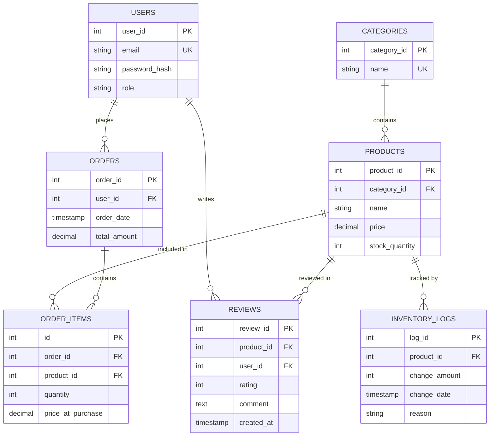

# Database Design Document

## Overview
The Smart E-Commerce System uses a relational database (MySQL) designed in **Third Normal Form (3NF)** to ensure data integrity and reduce redundancy.

## Entity Relationship Diagram (ERD)

## Schema Details

### 1. Users Table
Stores authentication and authorization details.
- **Primary Key**: `user_id`
- **Constraints**: `email` must be unique.

### 2. Categories Table
Classifies products.
- **Primary Key**: `category_id`
- **Constraints**: `name` must be unique.

### 3. Products Table
Core entity representing items for sale.
- **Primary Key**: `product_id`
- **Foreign Key**: `category_id` references `categories(category_id)`.
- **Indexes**: 
    - `idx_products_name` (for search optimization)
    - `idx_products_category` (for filtering)

### 4. Orders Table
Represents a transaction.
- **Primary Key**: `order_id`
- **Foreign Key**: `user_id` references `users(user_id)`.

### 5. OrderItems Table
Junction table for Many-to-Many relationship between Orders and Products.
- **Primary Key**: `id`
- **Foreign Keys**: 
    - `order_id` references `orders(order_id)`
    - `product_id` references `products(product_id)`
- **Note**: Stores `price_at_purchase` to preserve historical pricing.

### 6. InventoryLogs Table
Audit trail for stock adjustments.
- **Primary Key**: `log_id`
- **Foreign Key**: `product_id` references `products(product_id)`.

### 7. Reviews Table
Customer feedback.
- **Primary Key**: `review_id`
- **Foreign Keys**: 
    - `product_id` references `products(product_id)`
    - `user_id` references `users(user_id)`
- **Constraints**: `rating` between 1 and 5.

## Normalization (3NF)
- **1NF**: All columns contain atomic values.
- **2NF**: All non-key attributes are fully functional dependent on the primary key.
- **3NF**: No transitive dependencies (e.g., `category_name` is in the `categories` table, not `products`).
